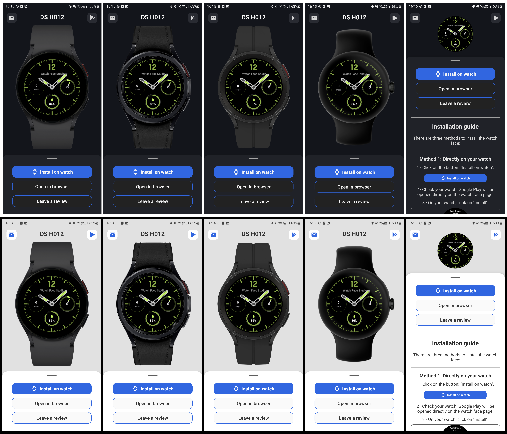
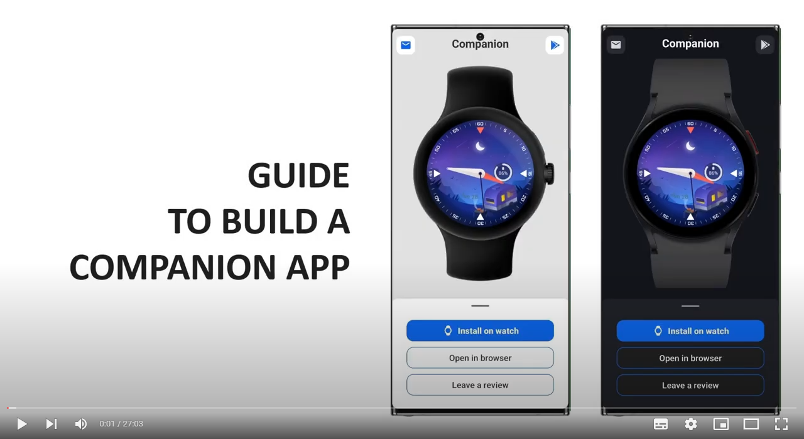

# Companion app for watch faces 
Change README language: 

 
 
As many of the watch face designers don't know how to code, I decided to build a companion app guide to help them.
 
 

##
### Features
- Shows one or more screenshot(s);
- Shows the user's watch model (4 models are included: GW, GW Pro, GW Classic and Pixel watch);
  - OR shows a fixed watch model (optional customization);
- Opens the watch store directly on the watch face page;
- Opens the watch face page on the user's browser instead of the phone's google play;
- Opens the user's email app with pre-defined input fields (your email, and the watch face name as subject);
- Redirects the user to the seller's google play page;
- Redirects the user to the watch face page on the phone's google play (review option);
- Instructions, for the user, on how to install the watch face;
- Option to refresh connection;
- Auto refreshes in case of disconnected device;
- Light and dark theme.

##
### Instructions
- Check the video bellow (will open on a new window) for guidance on how to build the watch face companion app; how to publish (short guide); and how to recycle the code.

##
### Credits
- Audio/Voice from the video were made using <a href="https://elevenlabs.io/" target="_blank" rel="noreferrer">ElevenLabs' TTS tool</a>;
- Icons are from <a href="https://fonts.google.com/" target="_blank" rel="noreferrer">Google Fonts</a>;
- Watch images are from google and samsung promotional files;
- Watch animation (inside the app) is from "Freepik" available at <a href="https://www.flaticon.com/br/icone-animado-gratis/relogio-inteligente_15575632" target="_blank" rel="noreferrer">Flaticon</a> [Modified]. They request attribution to use it! (Like the one I made here)

##
### License
- No specific license. You can use this code/files (the ones made by me) as you want, just make sure to read the credits section!

##
### Donations
- If you would like to support me, you can make a donation clicking on the button bellow... Thank you! ❤️

##
### Log
<b>v1.0.0</b>
<ul>
  <li>Release.</li>
</ul>
