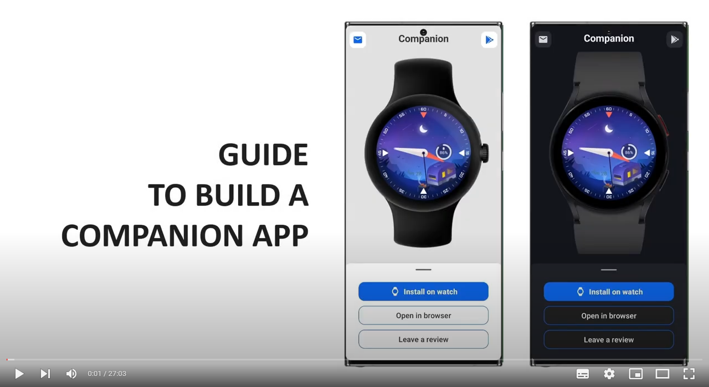

# Aplicativo companheiro para watch faces 
Altere o idioma do README: 

 
 
Como muitos designers de watch faces não sabem programar, eu decidi construir esse aplicativo para ajudá-los.
 
 

##
### Recursos
- Mostrar um ou mais prints;
- Mostrar uma imagem com o modelo do relógio do usuário (4 modelos disponíveis: GW, GW Pro, GW Clássico e o Pixel Watch);
  - OU mostrar um modelo de relógio fixo (essa é uma customização opcional sua);
- Abrir a pagina da watch face diretamente na loja do relógio;
- Abrir a pagina da watch face diretamente no navegador do usuário, sem redirecionar para o app da google play;
- Abrir o app de email do usuário com alguns campos já definidos (com o seu email, e no campo assunto o nome da watch face);
- Redirecionar o usuário para a pagina do vendedor na google play;
- Redirecionar o usuário para a pagina da watch face na google play do celular (opção de "deixar uma avaliação");
- Instruções, para o usuáriom de como baixar e instalar a watch face;
- Opção de recarregar a conexão do app com o relógio;
- Opção de auto recarregar a conexão do app com o relógio, quando o dispositivo se desconecta sozinho;
- Tema claro e escuro.

##
### Instruções
- Veja o vídeo abaixo (abrirá em uma nova janela) para instruções de como construir o app; como publicar (resumido); e de como reciclar o código. (Vídeo em inglês, com legenda em português!)

##
### Créditos
- Áudio/Voz do vído foram gerados utilizando a ferramenta de <a href="https://elevenlabs.io/" target="_blank" rel="noreferrer">TTS da ElevenLabs</a>;
- Os icons são do <a href="https://fonts.google.com/" target="_blank" rel="noreferrer">Google Fonts</a>;
- As imagens dos relógios são dos arquivos promocionais da samsung e do google;
- A animação (dentro do app) é de "Freepik", disponível em <a href="https://www.flaticon.com/br/icone-animado-gratis/relogio-inteligente_15575632" target="_blank" rel="noreferrer">Flaticon</a> [Modified]. Eles pedem atribuição para utilizá-la! Como a que eu fiz aqui.

##
### Licença
- Não há nenhuma licença especifica. Você pode utilizar o código/arquivos (os quer foram feitos por mim) como quiser, apenas certifique-se de ler os créditos acima!

##
### Doações
- Caso você queira me apoiar, você pode fazer uma doação no paypal clicando <a href="https://www.paypal.com/donate/?hosted_button_id=JABJ3AYXJRCQJ">aqui</a>. Ou você pode usar uma das opções abaixo... Valeu! ❤️
 

 Moeda | Endereço
----|----|
Bitcoin | 3NkK4LMwMhKefe2phqf7Vrp1uQynu1Gs6x
Ethereum | 0xfea5dd21ebf73c5b4a2445c7713f6b5316dfac4d

##
### Log
<b>v1.0.0</b>
<ul>
  <li>Lançamento.</li>
</ul>
